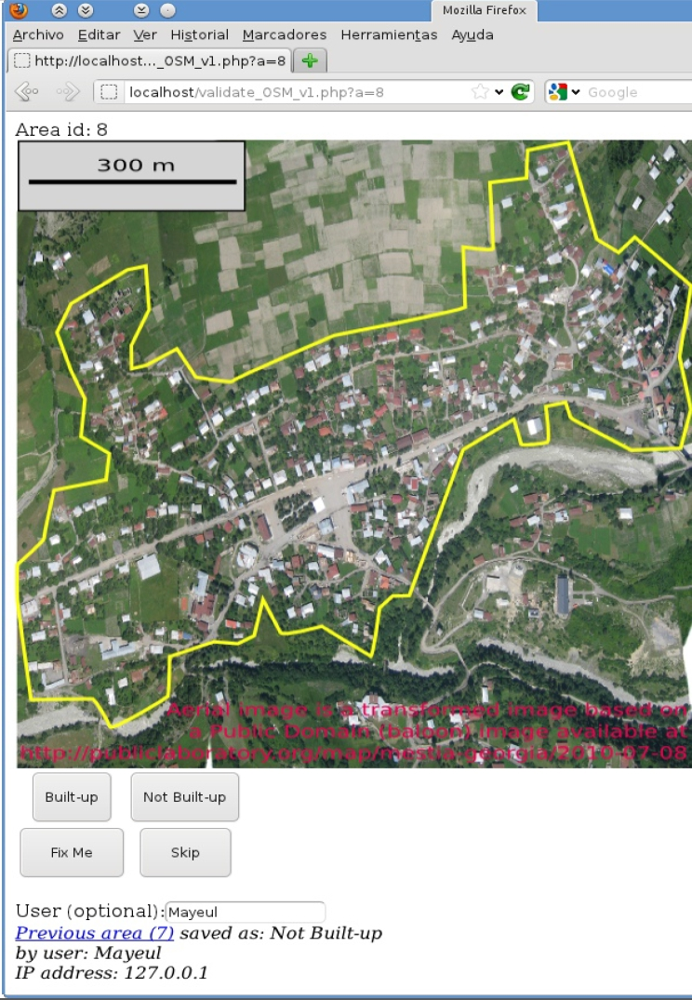

# UVARIOSM
This software (currently in an alpha state) is a prototype of a web platform for the User Validation of Automatically Recognised Items for OpenStreetMap (UVARIOSM).
Screenshots and some discussion are available in slides 48 to 53 of http://geomorfolab.arch.unige.it/attachments/article/48/03_Kauffmann_Telerilevamento_delle_aree_costruite.pdf

See also: https://wiki.openstreetmap.org/wiki/EC-JRC_built-up_areas_from_Bing

Curent partners who expressed interest:
- JRC GHSL team: http://ghsl.jrc.ec.europa.eu/
- CartONG: http://cartong.org/
- OpenStreetMap contributors

Screenshot of current prototype in action:

